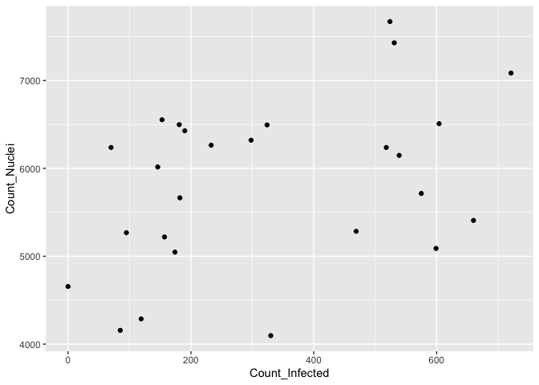

Inspect backend
================

If running interactively in RStudio,

  - change `output` in the header of this markdown to `html_notebook`
    and
  - change to `eval=TRUE` below

When knitting for pushing to GitHub,

  - change `output` in the header of this markdown to `github_document`
    and
  - change to `eval=FALSE` below

<!-- end list -->

``` r
show_table <- knitr::kable
```

``` r
suppressPackageStartupMessages(library(magrittr))
suppressPackageStartupMessages(library(tidyverse))
```

``` r
sqlite_file <- "~/Downloads/backend.sqlite"

db <- DBI::dbConnect(RSQLite::SQLite(), sqlite_file, loadable.extensions = TRUE)

DBI::dbListTables(db)
```

    ## [1] "Myexpt_image"    "Myexpt_infected" "Myexpt_nuclei"

``` r
image <- 
  tbl(src = db, "Myexpt_image") %>% collect() %>%
  select(TableNumber, ImageNumber, matches("^Count"))

infected <- 
  tbl(src = db, "Myexpt_infected")  %>% collect()

nuclei <- 
  tbl(src = db, "Myexpt_nuclei")  %>% collect()
```

``` r
names(infected) %<>% str_replace_all("^Myexpt_infected", "Infected")

names(nuclei) %<>% str_replace_all("^Myexpt_nuclei", "Nuclei")
```

``` r
ggplot(image, aes(Count_Infected, Count_Nuclei)) + geom_point()
```

<!-- -->

``` r
nuclei %>% head() %>% show_table()
```

| TableNumber | ImageNumber | ObjectNumber | Nuclei\_Location\_Center\_X | Nuclei\_Location\_Center\_Y | Nuclei\_Location\_Center\_Z | Nuclei\_Number\_Object\_Number |
| ----------: | ----------: | -----------: | --------------------------: | --------------------------: | --------------------------: | -----------------------------: |
|  1966364872 |           1 |            1 |                   118.00000 |                    3.958333 |                           0 |                              1 |
|  1966364872 |           1 |            2 |                   922.17021 |                    4.255319 |                           0 |                              2 |
|  1966364872 |           1 |            3 |                  1034.73684 |                    3.605263 |                           0 |                              3 |
|  1966364872 |           1 |            4 |                  1069.76471 |                    4.235294 |                           0 |                              4 |
|  1966364872 |           1 |            5 |                  1116.40000 |                    3.750000 |                           0 |                              5 |
|  1966364872 |           1 |            6 |                    28.36364 |                    4.787879 |                           0 |                              6 |

``` r
infected %>% head() %>% show_table()
```

| TableNumber | ImageNumber | ObjectNumber | Infected\_Location\_Center\_X | Infected\_Location\_Center\_Y | Infected\_Location\_Center\_Z | Infected\_Number\_Object\_Number |
| ----------: | ----------: | -----------: | ----------------------------: | ----------------------------: | ----------------------------: | -------------------------------: |
|  1966364872 |           1 |            1 |                      682.7938 |                      9.781250 |                             0 |                                1 |
|  1966364872 |           1 |            2 |                      651.6293 |                      9.387931 |                             0 |                                2 |
|  1966364872 |           1 |            3 |                       25.3964 |                     10.342342 |                             0 |                                3 |
|  1966364872 |           1 |            4 |                      282.0156 |                     10.164062 |                             0 |                                4 |
|  1966364872 |           1 |            5 |                      639.0211 |                     10.316901 |                             0 |                                5 |
|  1966364872 |           1 |            6 |                      664.4424 |                     16.514019 |                             0 |                                6 |
